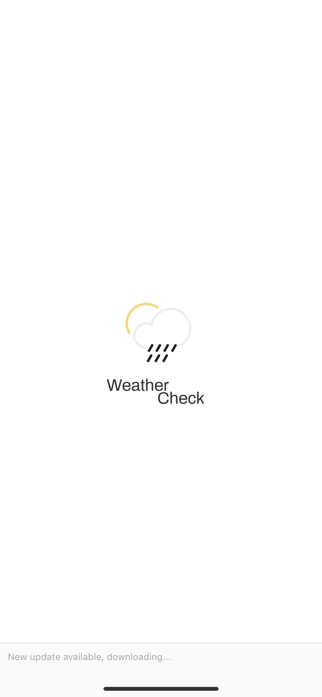
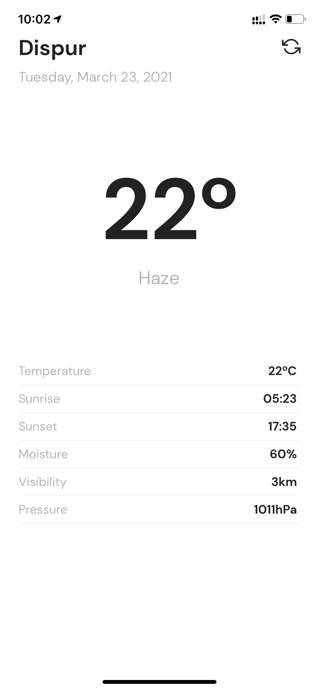

<h1 align="center">
    
</h1>

  
  

  <a href="#-about">About</a>&nbsp;&nbsp;&nbsp;|&nbsp;&nbsp;&nbsp;
  <a href="#-layout">Layout</a>&nbsp;&nbsp;&nbsp;|&nbsp;&nbsp;&nbsp;
  <a href="#-run-project">Run project</a>&nbsp;&nbsp;&nbsp;

 

## &nbsp; Screenshots

 

## &nbsp; About

This is a simple application developed with Expo using React Native. It aims to search for current weather data based on the user's location coordinates using GPS.

## &nbsp; Layout

The layout was developed by me and was based on a minimalist, clean layout with only the necessary information the user.

## &nbsp; Run project

- This project was developed with Expo, so you need to have the expo installed globally on your machine: **`npm install expo-cli --global`** or **`yarn add expo-cli -g`**.

- With the expo installed, install the dependencies using the package manager of your choice: **`yarn`** or **`npm install`**.

- To search the API, you will need an access key, which can be generated by following the steps:
  - Access **[this](https://openweathermap.org/)** website and create an account with your email.
  - After creating an account, an access key will be sent to your email. Copy that key.
  - Access the folder **`src/config`** and create a file **`app.env.ts`** (use the base `app.env.example.ts` file) and insert your key in variable `openweather_api`.

- With the dependencies installed, run the server: **`yarn start`**, **`npm start`** or **`expo start`**;

- In the tab that opens in your browser, choose the option to view application:
  - **View on physical device:** Install the Expo app (or Expo CLI on Android) and scan the QR Code with your camera.
  - **View on emulator:** Install the Expo application on the emulator, and on the open tab after running the server, select the option: `Run on Android device/ emulator`.

---

Made with ❤ by Gavish Poddar
